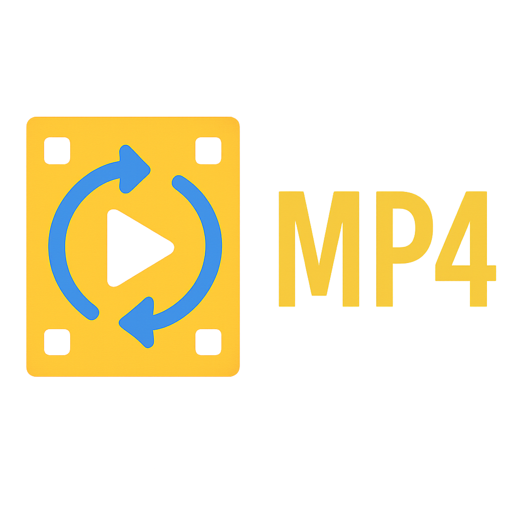

# MP4 Looper

A batch processing utility for creating extended video loops with background music.



## Overview

MP4 Looper is a Windows application that creates extended versions of MP4 video files, seamlessly looped with background music. It's perfect for creating long-duration meditation, relaxation, or ambient videos.

### Key Features

- **Batch Processing**: Process multiple video files in a single operation
- **Music Integration**: Add background music from an organized library
- **Duration Control**: Create loops of specific durations (1 hour, 3 hours, 11 hours, etc.)
- **Audio Fading**: Optional fade-out effect for smooth audio endings
- **Google Sheet Integration**: Pull music information from a Google Sheet
- **Google Drive Upload**: Automatically upload completed videos to Google Drive
- **Timestamp Generation**: Create timestamps for the background music

## Requirements

- Windows 10/11
- FFmpeg (automatically installed if not present)
- NVIDIA GPU (recommended for hardware acceleration)
- Internet connection (for Google Sheet/Drive features)

## Installation

1. Download the latest release from the [Releases](https://github.com/tran-thinh99-repo/mp4-looper/releases) page
2. Extract the ZIP file to a location of your choice
3. Run `MP4 Looper.exe` to start the application

## Usage

### Basic Workflow

1. **Drag and drop** MP4 files or folders into the application
2. Set the desired **loop duration** in seconds or use the preset buttons
3. Configure **output folder** and **music folder** locations
4. Enter your **Google Sheet URL** containing music data
5. Click **Start Processing** to begin rendering

### Input Files

MP4 Looper accepts:
- Individual `.mp4` files
- Folders containing `.mp4` files

### Configuration Options

- **Output Folder**: Where the processed videos and metadata are saved
- **Music Folder**: Location of the WAV files for background music
- **Google Sheet URL**: Link to the sheet containing music information
- **Loop Duration**: Length of the output video in seconds
- **Audio Fade**: Toggle for fading audio at the end
- **Export Timestamp**: Generate timestamp files for music
- **Auto-Upload**: Automatically upload to Google Drive after processing

## Google Sheet Format

The application expects a Google Sheet with the following structure:
- Column A: Song ID (numeric)
- Column B: Song Name
- Column C: Combined ID_Name
- Column E: Week information (date)

Example:
```
A,B,C,D,E
430,Slow Down,430_Slow Down,,05/07/2024
431,Perfect Day,431_Perfect Day,,05/07/2024
```

## Troubleshooting

- **Missing FFmpeg**: The application will attempt to download and install FFmpeg if missing
- **NVIDIA Driver Issues**: Update to the latest NVIDIA drivers
- **Sheet Access Problems**: Ensure the Google Sheet is publicly accessible or shared with the service account
- **WAV Files Missing**: Verify that the music folder contains the WAV files referenced in the sheet

## Development

### Prerequisites

- Python 3.8+
- Required Python packages:
  ```
  pip install customtkinter tkinterdnd2 pillow google-api-python-client google-auth-oauthlib gspread psutil
  ```

### Building from Source

1. Clone the repository:
   ```
   git clone https://github.com/tran-thinh99-repo/mp4-looper.git
   ```

2. Navigate to the project directory:
   ```
   cd mp4-looper
   ```

3. Install dependencies:
   ```
   pip install -r requirements.txt
   ```

4. Run the application:
   ```
   python mp4_looper.py
   ```

5. Build executable (optional):
   ```
   build_mp4_looper.bat
   ```

## Credits

- FFmpeg for video processing: [https://ffmpeg.org/](https://ffmpeg.org/)
- customtkinter for the modern UI: [https://github.com/TomSchimansky/CustomTkinter](https://github.com/TomSchimansky/CustomTkinter)
- tkinterdnd2 for drag and drop functionality: [https://github.com/pmgagne/tkinterdnd2](https://github.com/pmgagne/tkinterdnd2)

## License

This project is licensed under the MIT License - see the LICENSE file for details.

## Contact

For support or feature requests, please contact:
- GitHub: [tran-thinh99-repo](https://github.com/tran-thinh99-repo)
